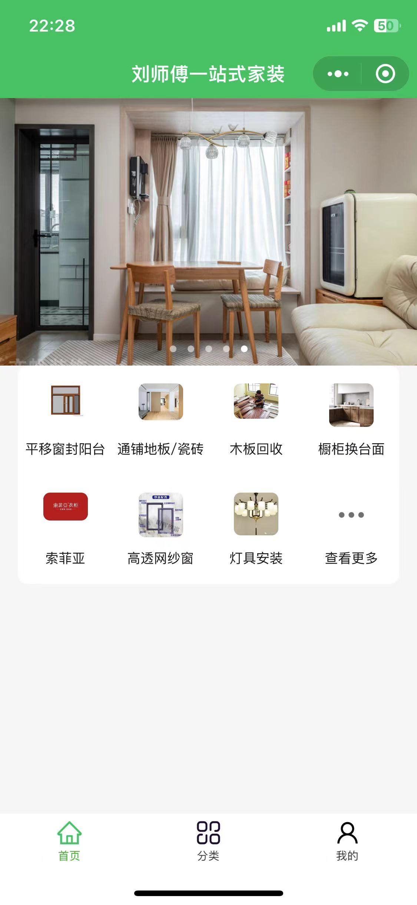
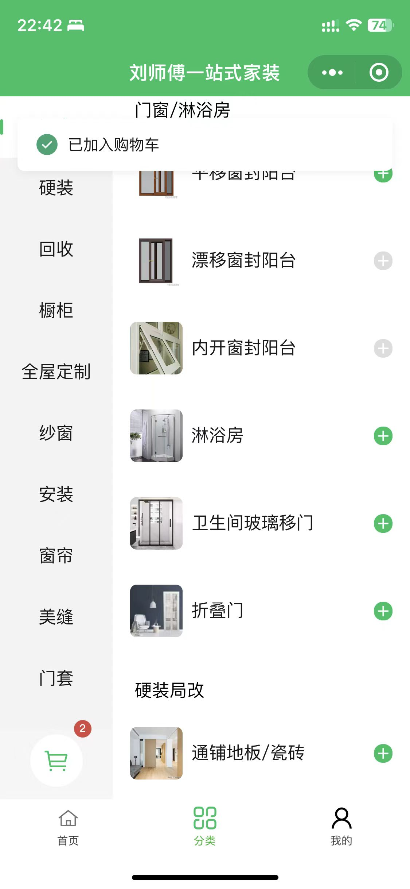
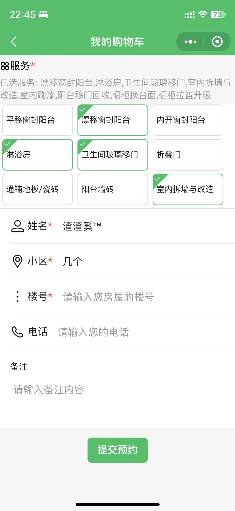
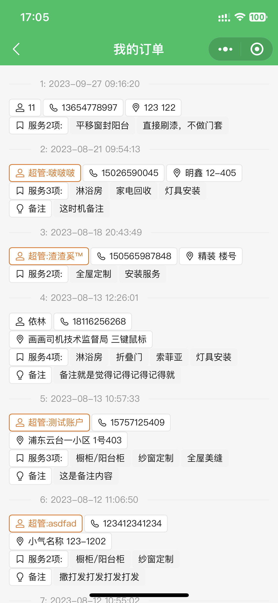
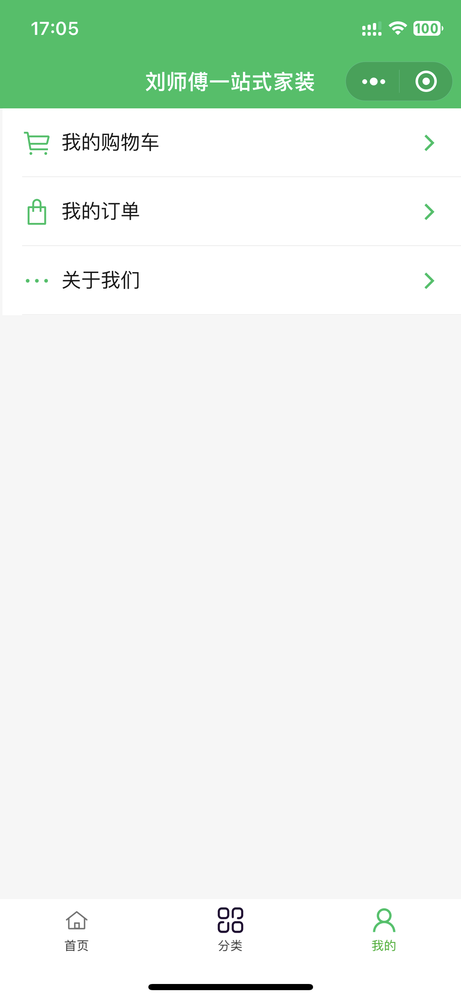

# 装修项目微信小程序
## 背景介绍
- 目前的流程
    - 1.微信群宣传装修能力 
    - 2.用户沟通 + 收集需求
    - 3.装修老板分发需求
- 期望的流程：
    - 1.微信群通过小程序承载上述一二步骤
    - 2.装修老板分发需求
## 主要功能
todo待完善
## 截图示例
|首页|菜单|购物车|订单|用户|
| - | - | - |- |- |
| |||||
